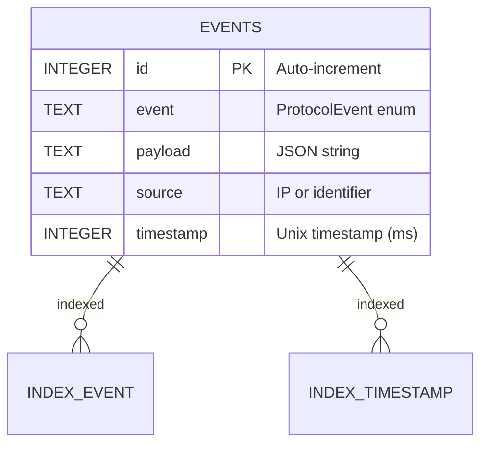
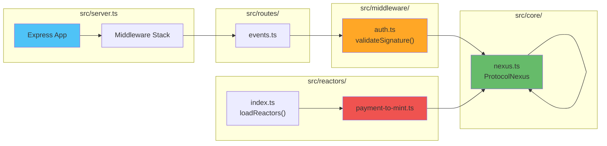

<!-- markdownlint-disable MD003 MD007 MD013 MD022 MD023 MD025 MD029 MD032 MD033 MD034 -->
# NEO NEXUS - ARCHITECTURE DIAGRAM

```text
========================================
    NEXUS ARCHITECTURE v1.0
========================================
[####] Phase 1 Foundation ............ OK
[####] Event Bus + Persistence ....... OK
[####] HMAC Authentication ........... OK
[####] Reactors System ............... OK
========================================
```

## System Architecture

```mermaid
graph TB
    subgraph External["🌐 EXTERNAL NODES"]
        FLOWPAY["💰 FlowPay<br/>PIX/Crypto Gateway"]
        FACTORY["🏭 Smart Factory<br/>Token Deployer"]
        NEOBOT["🤖 Neobot Core<br/>WhatsApp/Telegram"]
        FLUXX["⚖️ Fluxx DAO<br/>Governance"]
    end

    subgraph Nexus["⚡ NEO NEXUS (Orchestrator)"]
        direction TB
        
        subgraph API["🌐 HTTP API Layer"]
            HEALTH["/health<br/>Health Check"]
            EVENTS["/api/events<br/>Event Ingress"]
            LOG["/api/events/log<br/>Audit Trail"]
        end
        
        subgraph Auth["🔐 Security Layer"]
            HMAC["HMAC-SHA256<br/>Signature Validation"]
            CORS["CORS<br/>Origin Control"]
        end
        
        subgraph Core["🧠 Core Event Bus"]
            EVENTBUS["Protocol Nexus<br/>EventEmitter"]
            DISPATCH["dispatch()<br/>Event Router"]
            LISTEN["onEvent()<br/>Subscriber"]
        end
        
        subgraph Persistence["💾 Persistence Layer"]
            DB["SQLite Database<br/>nexus.db"]
            PERSIST["persistEvent()<br/>Audit Log"]
            QUERY["getEventLog()<br/>Query History"]
        end
        
        subgraph Reactors["⚙️ Reactors (IFTTT Logic)"]
            R1["Payment → Mint<br/>Reactor"]
            R2["Mint → Notify<br/>Reactor"]
            R3["Custom<br/>Reactors"]
        end
    end

    %% External → Nexus Flow
    FLOWPAY -->|"POST /api/events<br/>X-Nexus-Signature"| EVENTS
    FACTORY -->|"POST /api/events<br/>MINT_CONFIRMED"| EVENTS
    FLUXX -->|"POST /api/events<br/>PROPOSAL_CREATED"| EVENTS
    
    %% API → Auth → Core Flow
    EVENTS --> HMAC
    HMAC --> CORS
    CORS --> DISPATCH
    
    %% Core → Persistence
    DISPATCH --> PERSIST
    PERSIST --> DB
    
    %% Core → Reactors
    DISPATCH --> LISTEN
    LISTEN --> R1
    LISTEN --> R2
    LISTEN --> R3
    
    %% Reactors → External
    R1 -->|"POST /api/mint<br/>Bearer Token"| FACTORY
    R2 -->|"WebSocket<br/>Notification"| NEOBOT
    
    %% Query Flow
    LOG --> QUERY
    QUERY --> DB
    
    %% Styling
    classDef external fill:#ff6b6b,stroke:#c92a2a,stroke-width:2px,color:#fff
    classDef api fill:#4dabf7,stroke:#1971c2,stroke-width:2px,color:#fff
    classDef auth fill:#ffd43b,stroke:#f08c00,stroke-width:2px,color:#000
    classDef core fill:#51cf66,stroke:#2f9e44,stroke-width:3px,color:#000
    classDef persist fill:#a78bfa,stroke:#7c3aed,stroke-width:2px,color:#fff
    classDef reactor fill:#ff8787,stroke:#fa5252,stroke-width:2px,color:#fff
    
    class FLOWPAY,FACTORY,NEOBOT,FLUXX external
    class HEALTH,EVENTS,LOG api
    class HMAC,CORS auth
    class EVENTBUS,DISPATCH,LISTEN core
    class DB,PERSIST,QUERY persist
    class R1,R2,R3 reactor
```



────────────────────────────────────────

## Event Flow Diagram

```mermaid
sequenceDiagram
    participant FP as 💰 FlowPay
    participant NX as ⚡ Nexus API
    participant AU as 🔐 Auth
    participant EB as 🧠 Event Bus
    participant DB as 💾 Database
    participant R1 as ⚙️ Payment→Mint
    participant SF as 🏭 Smart Factory
    participant NB as 🤖 Neobot

    Note over FP,NB: Payment Flow (End-to-End)
    
    FP->>FP: PIX Received
    FP->>FP: Generate HMAC Signature
    FP->>NX: POST /api/events<br/>{event: PAYMENT_RECEIVED}
    
    NX->>AU: Validate Signature
    AU->>AU: HMAC-SHA256 Check
    AU-->>NX: ✓ Valid
    
    NX->>EB: dispatch(PAYMENT_RECEIVED)
    EB->>DB: persistEvent()
    DB-->>EB: Event ID: 123
    
    EB->>R1: Trigger Reactor
    R1->>R1: Calculate Mint Amount
    R1->>SF: POST /api/mint<br/>{amount, address}
    SF-->>R1: 200 OK {txHash}
    
    R1->>EB: dispatch(MINT_REQUESTED)
    EB->>DB: persistEvent()
    
    NX-->>FP: 200 OK {status: dispatched}
    
    Note over SF: On-chain confirmation...
    
    SF->>NX: POST /api/events<br/>{event: MINT_CONFIRMED}
    NX->>EB: dispatch(MINT_CONFIRMED)
    EB->>NB: Notify User (WebSocket)
    NB->>NB: Send WhatsApp Message
```



────────────────────────────────────────

## Data Flow Diagram

```mermaid
flowchart LR
    subgraph Input["📥 INPUT"]
        WH1["FlowPay Webhook"]
        WH2["Factory Webhook"]
        WH3["Fluxx Webhook"]
    end
    
    subgraph Validation["🔐 VALIDATION"]
        SIG["HMAC Signature<br/>Verification"]
        TYPE["Event Type<br/>Validation"]
        PAYLOAD["Payload<br/>Schema Check"]
    end
    
    subgraph Processing["⚡ PROCESSING"]
        BUS["Event Bus<br/>Dispatch"]
        REACT["Reactors<br/>Execute"]
    end
    
    subgraph Storage["💾 STORAGE"]
        AUDIT["Audit Log<br/>(SQLite)"]
        METRICS["Metrics<br/>(Future)"]
    end
    
    subgraph Output["📤 OUTPUT"]
        API1["Smart Factory API"]
        API2["Neobot WebSocket"]
        API3["External Services"]
    end
    
    WH1 --> SIG
    WH2 --> SIG
    WH3 --> SIG
    
    SIG --> TYPE
    TYPE --> PAYLOAD
    PAYLOAD --> BUS
    
    BUS --> AUDIT
    BUS --> REACT
    
    REACT --> API1
    REACT --> API2
    REACT --> API3
    
    AUDIT --> METRICS
    
    style Input fill:#e3f2fd
    style Validation fill:#fff3e0
    style Processing fill:#e8f5e9
    style Storage fill:#f3e5f5
    style Output fill:#fce4ec
```



────────────────────────────────────────

## Database Schema



────────────────────────────────────────

## Component Interaction



────────────────────────────────────────

▓▓▓ NΞØ MELLØ
────────────────────────────────────────
Core Architect · NΞØ Protocol
neo@neoprotocol.space

"Code is law. Expand until
 chaos becomes protocol."

Security by design.
Exploits find no refuge here.
────────────────────────────────────────
