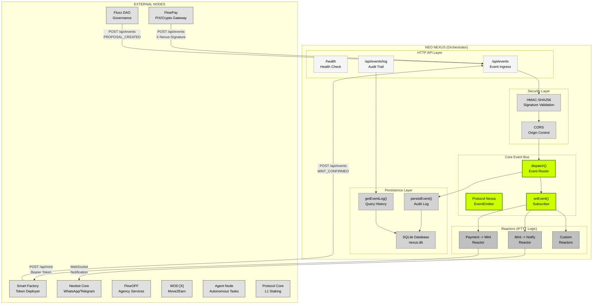
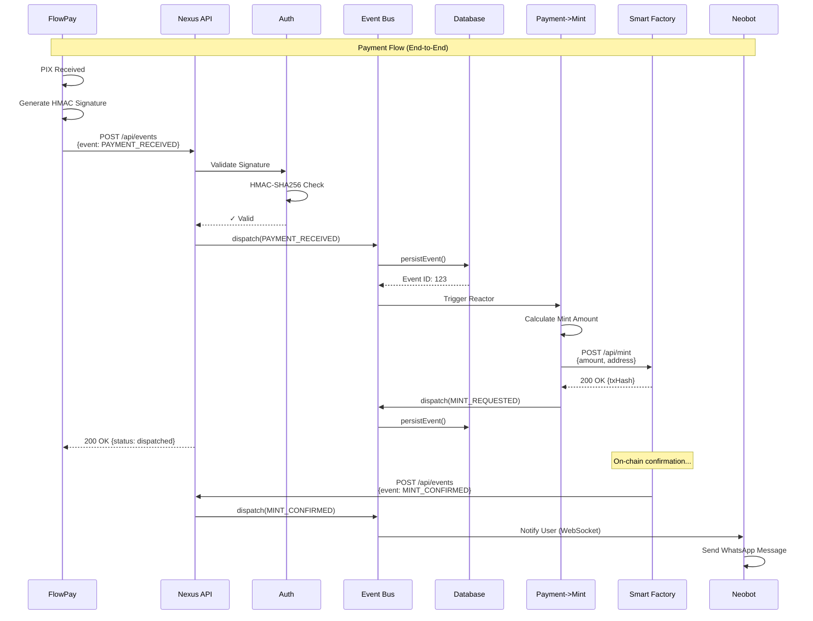
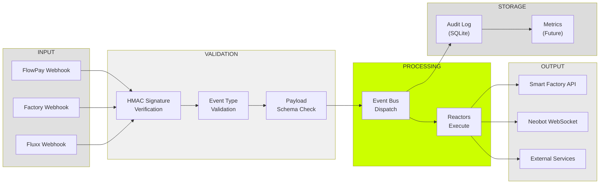
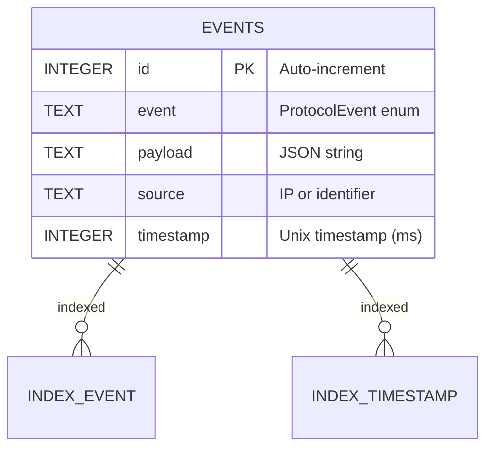
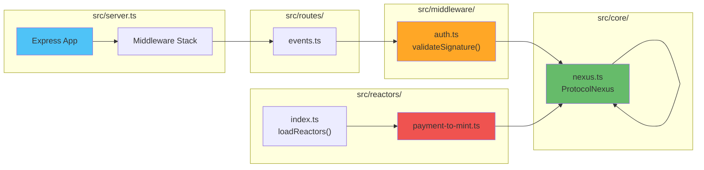

<!-- markdownlint-disable MD003 MD007 MD013 MD022 MD023 MD025 MD029 MD032 MD033 MD034 -->
# NEO NEXUS - ARCHITECTURE DIAGRAM

```text
========================================
    NEXUS ARCHITECTURE v1.0
========================================
[####] Phase 1 Foundation ............ OK
[####] Event Bus + Persistence ....... OK
[####] HMAC Authentication ........... OK
[####] Reactors System ............... OK
========================================
```

## System Architecture



────────────────────────────────────────

## Event Flow Diagram



────────────────────────────────────────

## Data Flow Diagram



────────────────────────────────────────

## Database Schema



────────────────────────────────────────

## Component Interaction



────────────────────────────────────────

▓▓▓ NΞØ MELLØ
────────────────────────────────────────
Core Architect · NΞØ Protocol
neo@neoprotocol.space

"Code is law. Expand until
 chaos becomes protocol."

Security by design.
Exploits find no refuge here.
────────────────────────────────────────
