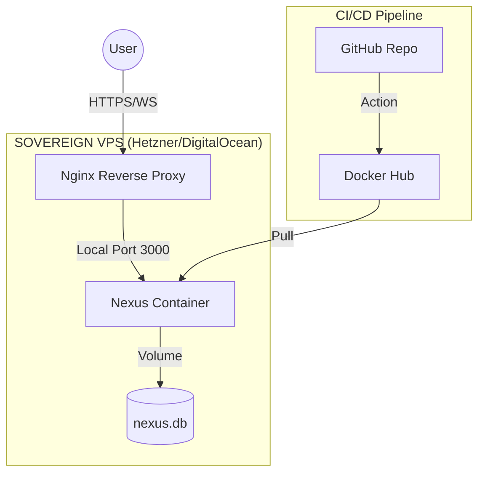

<!-- markdownlint-disable MD003 MD007 MD013 MD022 MD023 MD025 MD029 MD032 MD033 MD034 -->
# NEO NEXUS - INFRASTRUCTURE PLAN

```text
========================================
    SOVEREIGN INFRASTRUCTURE ROADMAP
========================================
[####] Current: Local/Mac Development OK
[#---] Phase 2: Railway (Staging) .. NEXT
[#---] Phase 3: Sovereign VPS ...... NEXT
========================================
```

## 1. Visão de Soberania

O Nexus é o sistema nervoso central do
NEO Protocol. Rodar em máquinas locais
ou serviços gerenciados (PaaS) limita a
autonomia e a segurança do ecossistema.

A migração para uma **VPS Soberana** é
o passo final para a maturidade do
Protocolo, garantindo domínio total
sobre o hardware e a rede.

## 2. Por que sair do Local?

```text
▓▓▓ MOTIVAÇÃO
────────────────────────────────────────
└─ Disponibilidade 24/7
   O Nexus nunca pode dormir.

└─ IP Fixo (Whitelist)
   Essencial para integração com:
   • Gateways Bancários (FlowPay)
   • Smart Contract Oracles
   • Webhooks Reais

└─ Segurança de Rede
   Firewalls dedicados e isolamento.
```

## 3. Arquitetura Alvo



## 4. Requisitos Técnicos

```text
▓▓▓ HARDWARE MÍNIMO (Nexus v1)
────────────────────────────────────────
└─ CPU: 1-2 vCPU
└─ RAM: 2GB (4GB Recomendado)
└─ SSD: 40GB+
└─ OS: Ubuntu 24.04 LTS
```

```text
▓▓▓ SOFTWARE STACK
────────────────────────────────────────
└─ Runtime: Docker + Docker Compose
└─ Proxy: Nginx ou Traefik
└─ SSL: Let's Encrypt (Certbot)
└─ Security: Fail2Ban + UFW Firewall
```

## 5. Roadmap de Migração

### Fase 2: Railway (Transição)
- Publicação via GitHub.
- Validação do `NEXUS_SECRET`.
- Conexão inicial dos primeiros nós.

### Fase 3: VPS Soberana (Maturidade)
- Provisionamento de VPS Linux.
- Configuração de SSH Hardening.
- Setup de Docker Compose.
- Backup automatizado da `nexus.db`.
- Monitoramento (Grafana/Prometheus).

## 6. Provedores Recomendados

1. **Hetzner (EU)**: Melhor custo-benefício.
2. **DigitalOcean (US)**: Facilidade de uso.
3. **AWS (Global)**: Escalabilidade extrema.

────────────────────────────────────────

▓▓▓ NΞØ MELLØ
────────────────────────────────────────
Core Architect · NΞØ Protocol
neo@neoprotocol.space

"Code is law. Expand until
 chaos becomes protocol."

Security by design.
Exploits find no refuge here.
────────────────────────────────────────
