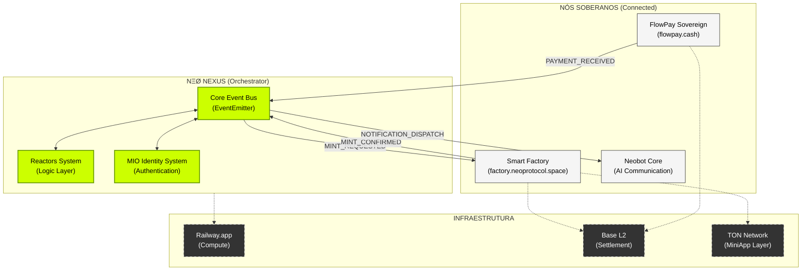
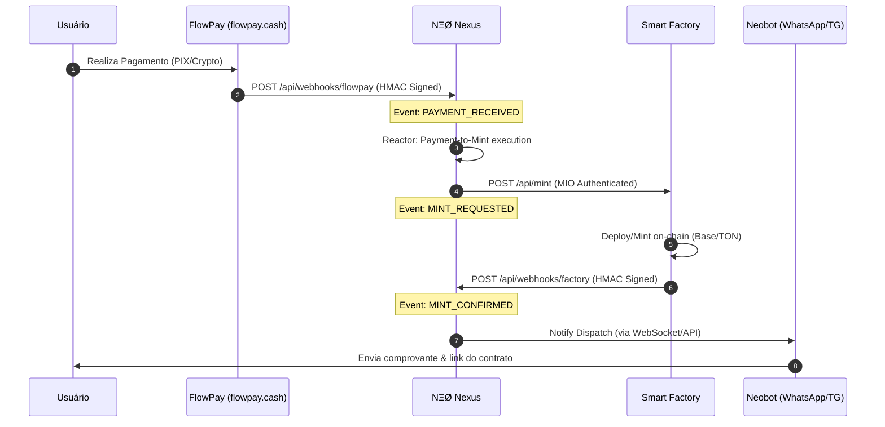
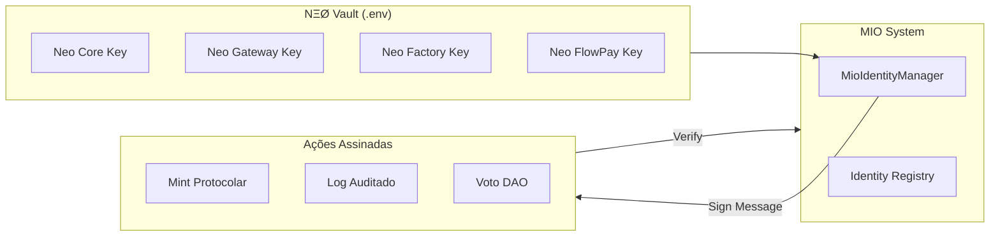

<!-- markdownlint-disable MD003 MD007 MD013 MD022 MD023 MD025 MD029 MD032 MD033 MD034 -->
# 📊 NΞØ PROTOCOL - SISTEMA DE DIAGRAMAS

Este documento contém a representação visual da arquitetura orquestrada pelo **NΞØ Nexus**. Todos os diagramas utilizam Mermaid e refletem as conexões reais de produção.

---

## 1. Arquitetura Global do Ecossistema

O Nexus atua como o **Centro de Comando**, desacoplando os nós soberanos e garantindo que o protocolo escale organicamente.

---

## 2. Fluxo Principal: Pagamento -> Mint -> Notificação

Este é o "Happy Path" do protocolo, onde o Nexus coordena o FlowPay, a Smart Factory e o Neobot.

---

## 3. Camada de Identidade MIO (Sovereign Identities)

Como os nós autenticam suas ações de forma soberana usando as 9 identidades registradas.

---

## 4. Mapa Logístico de Endpoints

| Nó | Produção | Função |
| :--- | :--- | :--- |
| **Nexus Core** | `nexus.neoprotocol.space` | Orquestração e Barramento |
| **FlowPay** | `flowpay.cash` | Gateway de Pagamentos |
| **Smart Factory** | `factory.neoprotocol.space` | Deploys de Contratos |
| **Neobot** | `neobot.neoprotocol.space` | Comunicação IA |
| **MIO ID** | `id.neoprotocol.space` | Identidade Digital |

---

▓▓▓ NΞØ MELLØ
────────────────────────────────────────
Core Architect · NΞØ Protocol
"Design is the first step of protocol."
────────────────────────────────────────
